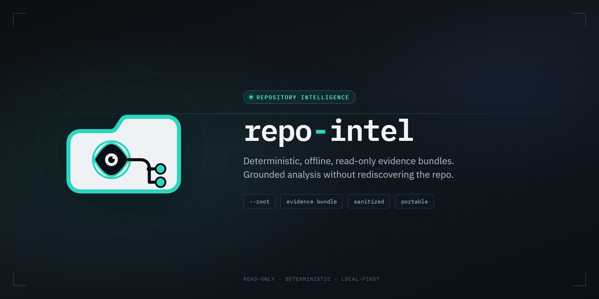

<p align="center">
  
</p>

# repo-intel

Deterministic, offline, read-only repository intelligence exporter. Walks a repository and emits
a sanitized, portable evidence bundle — files, git state, configuration, delivery/CI surfaces,
planning documents, and product signals — that can ground architecture analysis in an LLM
conversation without pasting the repo in by hand.

**Extracted from SliceBoard on 2026-08-06.** This tool was built and originally lived inside
`ohnoai/sliceboard`, tied to one project's repository. It's general-purpose — `--root` drives all
file and configuration resolution, and the planning collector degrades cleanly to generic defaults
against any repository — so it now has its own home. Point `--root` at any repository instead of
copying the tool into each one. See
[`docs/decisions/2026-08-06-repository-intelligence-exporter-extraction.md`](docs/decisions/2026-08-06-repository-intelligence-exporter-extraction.md)
for the extraction record and [`docs/README.md`](docs/README.md) for the full history and design
knowledge base.

## Usage

```
node export.mjs --root /path/to/some/repository
```

Writes two artifacts to `<root>/tmp/repository-intelligence/`: `evidence-bundle.json` (the full
sanitized evidence) and `summary.md` (a per-collector status table plus warnings).

```
Usage: node export.mjs [options]

Options:
  --root <path>       Repository root (default: current directory)
  --output <path>     Must resolve to the dedicated exporter artifact directory,
                       tmp/repository-intelligence under --root (default: tmp/repository-intelligence).
                       Any other value is rejected; this flag exists to make that
                       directory explicit on the command line, not to relocate output.
  --overwrite         Explicitly replace existing evidence artifacts
  --include-diff      Include sanitized Git diff summary metadata (never raw patches)
  --base <ref>        Explicit diff base (default precedence: merge-base(HEAD, main)
                       -> the branch's own upstream -> HEAD, with a warning rather than
                       a failure when it resolves to HEAD)
  --help              Show this help
```

## Configuration

No configuration is required — with none present, the planning collector falls back to generic
defaults (`AGENTS.md`, `README.md`, `docs/code-map.md` as authority documents; `docs/decisions`,
`docs/tasks`, `docs/roadmap`, `docs/plans`, `tasks`, `plans` as planning directories) and produces
clean output against any repository.

To declare a repository's own authority documents, drop a `.repo-intelligence.json` at its root —
see [`.repo-intelligence.json.example`](.repo-intelligence.json.example):

```json
{
  "authorityDocuments": {
    "AGENTS.md": "agent-guidance",
    "README.md": "repository-overview"
  },
  "requiredAuthorityDocuments": ["AGENTS.md"]
}
```

Every declared path is forced through the same path sanitizer the collectors use internally, so a
config file cannot point collection outside its own repository.

## Collectors

| Collector | Emits |
| --- | --- |
| files | repository file inventory (via `git ls-files` + fs fallback), classification, `.env*` flagged but never read |
| git | branch/head/worktree/commit metadata + an optional diff summary (name-status/numstat, never raw patch) |
| configuration | environment-variable **names** + visibility classification (never values) |
| delivery | CI workflows, deployment config, workflow env/secret **names** |
| planning | authority/decision/task document metadata, repository-agnostic via `.repo-intelligence.json` |
| product | product signals + risk-surface detection via bounded source scans (paths only) |

**Known limitation:** `lib/collect-product.mjs` is still tuned to SliceBoard specifically —
hardcoded `product: "SliceBoard"`, and signal patterns for things like `PizzaWindowChart`,
`MAX_PIES`, and Stripe. Against any other repository it degrades gracefully (`metadata.product`
comes back `null`, no signals fire) but doesn't yet detect anything meaningful there. Generalizing
it — the same way the planning collector became configurable — is open work, not started.

## Privacy

The exporter never reads `.env` values, never exports binary content or raw diffs, and redacts
credentials, tokens, emails, and local absolute paths before anything is written. A final
validation pass — independent of the redactor's own allowlist — is fatal on any residual sensitive
content, so a redaction gap fails the write rather than silently shipping. Full design rationale in
[`docs/02-history-and-decisions.md`](docs/02-history-and-decisions.md).

## Status

Not a finished v1. **105 focused tests pass** as of 2026-08-05 (sanitize 33, collectors 23,
configuration 22, export 19, planning-product 8) — verified in `ohnoai/sliceboard` prior to
extraction; run `npm test` here to reverify against this repository directly. Slices S3
(warnings/observations split), S6 (schema v2), and S7 (test-coverage hardening) are still open —
see [`docs/04-remediation-plan.md`](docs/04-remediation-plan.md).

## Development

```
npm install
npm test                       # full suite
npm run test:sanitize          # sanitize.test.mjs only
npm run test:collectors        # collectors.test.mjs only
npm run test:configuration     # configuration.test.mjs only
npm run test:export            # export.test.mjs only
npm run test:planning-product  # planning-product.test.mjs only
npm run export -- --root .     # run the exporter against this repo itself
```
